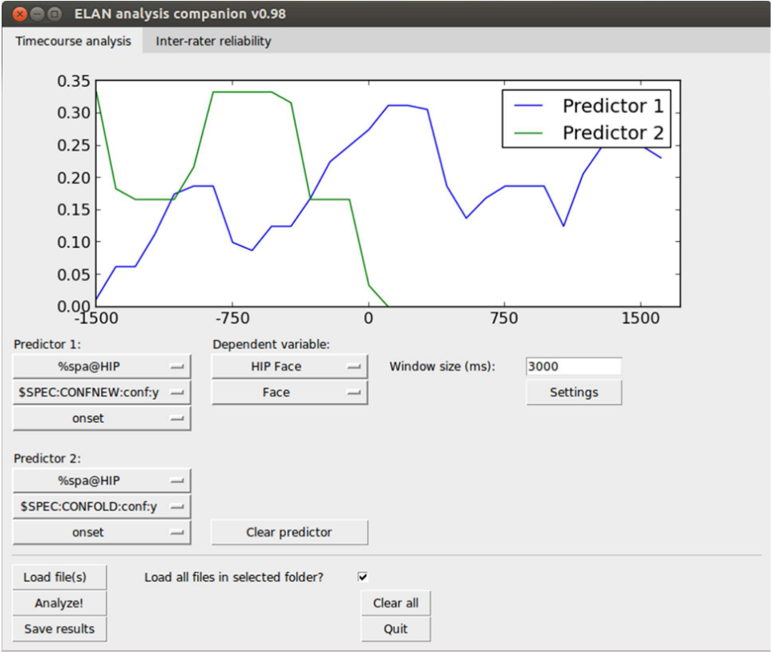
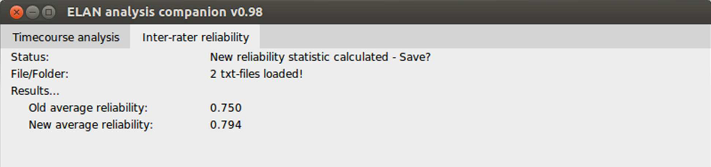

# ELAN Analysis Companion (EAC)

A python software for performing visual time-course analysis on data annotated in ELAN. The extracted data can be saved in a format that makes statistical testing of ELAN data much simpler. 

Finally, it can provide a time-weighted inter-annotator reliability calculation which (we believe) is an improvement to the "Compare annotator" functionality that is/was in ELAN. It simply means that longer events have a proportionally larger impact on the reliability calculation.

